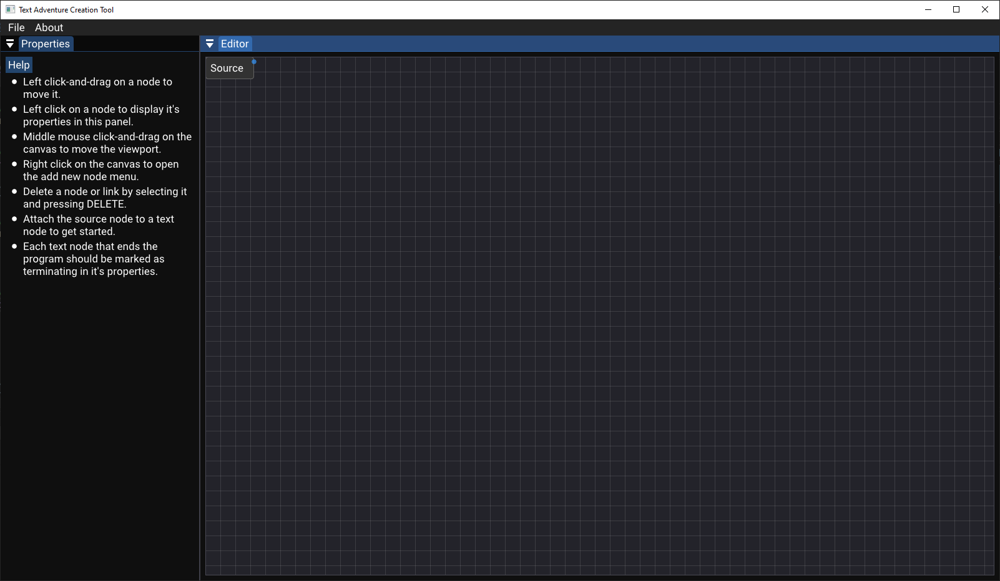
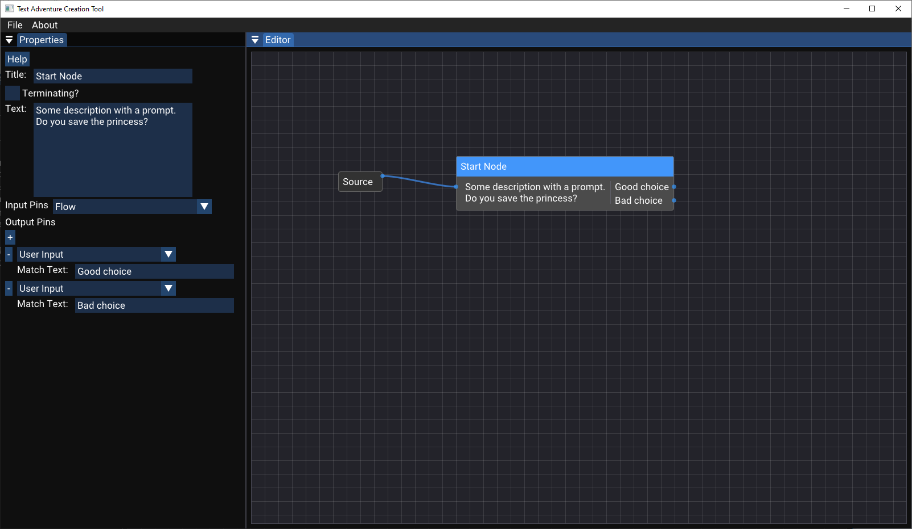
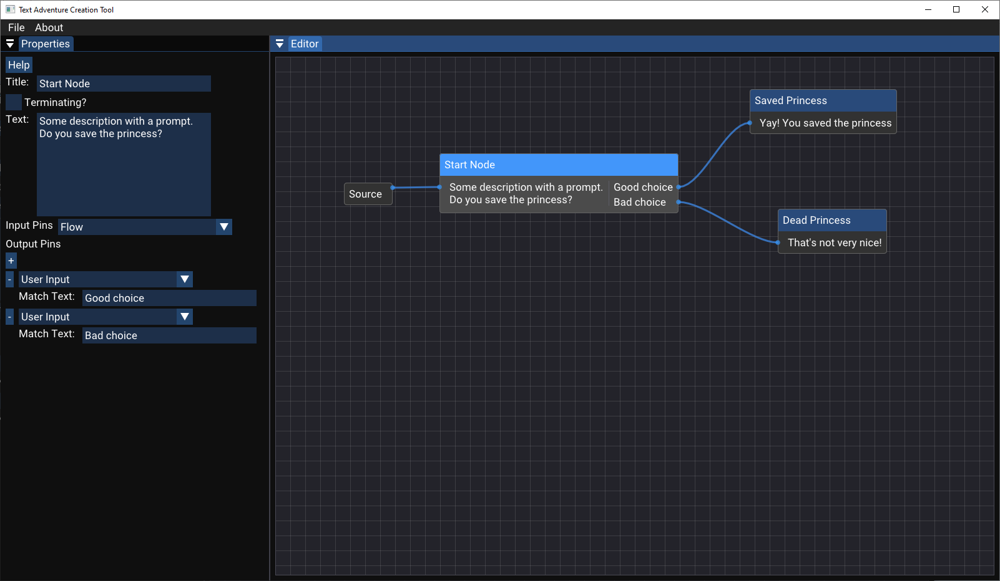

# TACT
Text Adventure Creation Tool, A tool, for creating, Text Adventure Games (TAGs).

## Introductions
This repository is an exercise set to me by a prospective employer.

The task is to create an engine or other tool for the creation of text adventure style games, hence I present TACT, the Text Adventure Creation Tool.

I use [Walnut](https://github.com/StudioCherno/Walnut) as the base for this operation, itself a wrapper around [Dear ImGui](https://github.com/ocornut/imgui), making use of the GLFW + Vulkan backend. I use ImGui due to its simplicity and the velocity it lends to development. Walnut is a well supported and documented wrapper for ImGui, which reduces code duplication and boilerplate requirements for ImGUI. Further I make use of [imnodes](https://github.com/Nelarius/imnodes) to power the node-based editor.

## Installation

### Requirements
- Windows 11. Since Walnut is a Windows only (for now) wrapper for ImGui.
- [Visual Studio 2022](https://visualstudio.com)
- [Vulkan SDK](https://vulkan.lunarg.com/sdk/home#windows)

### Getting Started
We utilise premake to generate solution files, whose use is conveniently abstracted to `Setup.bat`. Once you've cloned, run `Setup.bat` to generate Visual Studio 2022 solution/project files. Once you've opened the solution, you can run the TACT project to launch the creation tool.

## Usage Instructions

### Landing screen

Upon running TACT you should be greeted with a screen like so:

You see two panels; on the left we have the properties panel, this is where the properties of the selected node will be visible and editable; on the right we have the main editor area, here we start with just the Source node, where the TAG's control flow will start - this is your entry point.

### The Editor

The editor has the following controls:
- Left click-and-drag on a node: Move the node
- Left click on a node: Display the node's properties in the properties panel
- Middle mouse click-and-drag on the canvas: Move the viewport on the canvas
- Right click on the canvas: Add new node right click menu

### Properties Panel

The properties panel displays details about the currently selected node. One can select a node by left clicking it in the editor.
In the properties panel we can also edit a nodes properties, these changes should be immediately reflected in the editor. We will look at an example of properties to change later after we've added a node that has properties we can change.

### Adding nodes

When you right click on a clear space in the editor you should be greeted by a menu to select what node you would like to add, currently only the Text Node is implemented - the primary building block of any TAG, its text. The right click menu should look as follows:

Once we have a Text Node, we can select it by clicking it, and we can move it by clicking and dragging it around. Once we have it selected we cannot deselect it, we must select another node to change what is displayed in the properties panel.
An example of one such Text Node with some properties already altered is:

Here we can see how we can change the title, and main content text (this is the text that will be displayed to the player if they make it to this node), as well as add, remove, and edit the input and output pins on the node. Here we've set one output node to the invalid input type - which defines the control flow for if the player inputs an otherwise unhandled input - and the others to various choices the player could make. We may then add some more nodes for the next step along our game like so:

You can see how from here we can grow and build a sprawling TAG!

### Saving/Loading

Saving and loading are currently not supported.

### Generating your Game

The final format for the output games hasn't been decided or implemented, for now TACT is less of a creation tool and more of a design or planning tool.

## Roadmap

- [ ] Saving/Loading
  - [ ] Serialisation/Deserialisation library chosen/written
  - [ ] Drag and drop save files onto application to load
- [ ] TAG (Game) Generation
  - [ ] Output format chosen
  - [ ] Format generation
- [ ] Be able to flip nodes to have inputs on the right and outputs on the left
  - [ ] A colour based demarkation of what side is input and output
- [ ] Zoom in and out in the editor
- [ ] Variable support
  - [ ] Support nodes outputing values and being input to other nodes, e.g. player health
- [ ] More node types
  - [ ] Logic node, apply logical statements to flow control, e.g. do this path when the player has more gold than x, and this path when they have less
- [ ] General styling UI/UX improvements - it's functional as is, but could look a lot nicer

## 3rd party libaries
- [imnodes](https://github.com/Nelarius/imnodes)
- [Walnut](https://github.com/StudioCherno/Walnut)

Which itself contains

- [Dear ImGui](https://github.com/ocornut/imgui)
- [GLFW](https://github.com/glfw/glfw)
- [stb_image](https://github.com/nothings/stb)
- [GLM](https://github.com/g-truc/glm)
