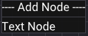

# TACT
Text Adventure Creation Tool, A tool, for creating, Text Adventure Games (TAGs).

## Introductions
This repository is designed to meet the criteria of an exercise set to me by a prospective employer, which was required to be available as a public GitHub repository, so here it is.

The task is to create an engine or other tool for the creation of text adventure style games, hence I present TACT, the Text Adventure Creation Tool.

I have used [Walnut](https://github.com/StudioCherno/Walnut) as the base for this operation, which is itself a wrapper around [Dear ImGui](https://github.com/ocornut/imgui), making use of the GLFW + Vulkan backend. I have elected to use ImGui due to its simplicity and the velocity it lends to development, I don't wish to waste a long time creating my own UI system from scratch, that would be sufficient work on its own. Walnut was a natural choice therefore, as it is basically ImGui with fewer steps, which allowed me to get into the meat of the problem quite quickly. Further I make use of [imnodes](https://github.com/Nelarius/imnodes) to power the node-based editor.

Since Walnut is a Windows only (for now) wrapper for ImGui, you will require a Windows 11 environment to use TACT.

## Requirements
- [Visual Studio 2022](https://visualstudio.com) (not strictly required, however included setup scripts only support this)
- [Vulkan SDK](https://vulkan.lunarg.com/sdk/home#windows) (preferably a recent version)

## Getting Started
We utilise premake to generate solution files, whose use is conveniently abstracted to `Setup.bat`. Once you've cloned, run `Setup.bat` to generate Visual Studio 2022 solution/project files. Once you've opened the solution, you can run the TACT project to launch the creation tool.

## Usage Instructions

Upon running TACT you should be greeted with a screen like so:

Here we see the landing page. You see two panels; on the left we have the properties panel, this is where the properties of the selected node will be visible and editable; on the right we have the main editor area, here we start with just the Source node, where the TAG's control flow will start - this is your entry point. In the editor area you may scroll by holding the middle mouse button down and dragging from any clear area of the canvas, further you may add nodes to the editor through the right click menu. When you right click on a clear space in the editor you should be greeted by a small menu to select what node you would like to add, currently only the Text Node is implemented - the primary building block of any TAG, its text. The right click menu should look as follows:

### 3rd party libaries
- [imnodes](https://github.com/Nelarius/imnodes)
- [Walnut](https://github.com/StudioCherno/Walnut)

Which itself contains

- [Dear ImGui](https://github.com/ocornut/imgui)
- [GLFW](https://github.com/glfw/glfw)
- [stb_image](https://github.com/nothings/stb)
- [GLM](https://github.com/g-truc/glm)
